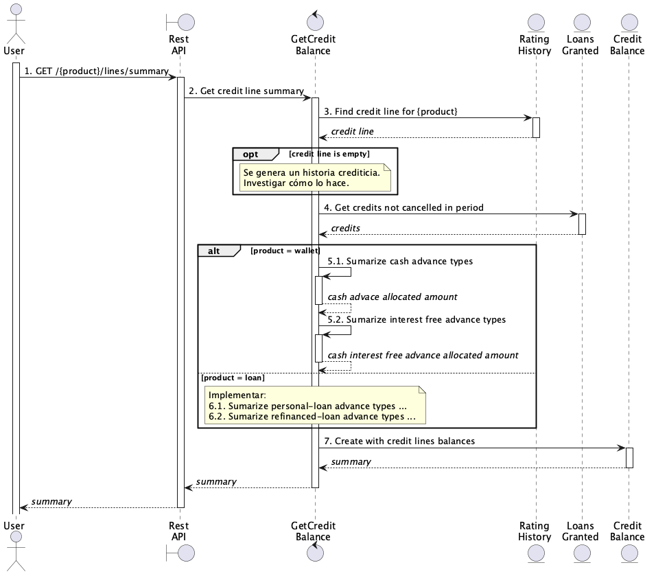

# Capacidad crediticia para cada línea de crédito

> Este documento es válido para el flujo originante por la billetera, no por la web de préstamos.

> Este documento no aborda la opción ICR.

## Diagrama de secuencia


1. Un usuario, autenticado, de billetera consulta su saldo disponible para alguna de las líneas de crédito disponibles según el `{produdct}` especificado (`wallet|loan`). Las líneas de crédito disponibles, según el producto son:
    - Billetera : `cash-advance` y `interest-free-advance`.
    - Préstamos : `personal-loan` y `refinanced-loan` (ambos sin implementar, de momento).
2. El controlador, delega la consulta del saldo disponible en el caso de uso GetCreditBalance.
3. Se buscan las líneas de crédito activas y vigentes para el usuario que realizó la solicitud.
4. Obtiene los créditos otorgados al usuario que no tengan estado `cancel`, durante el periodo de validez de la oferta de crédito.
5. Sumariza el monto de todos los créditos de tipo `cash-advance` (campo `amount`).
6. Sumariza el monto de todos los crédito de tipo `interest-free-advance` (campo `amount`).
7. Con los datos obtenidos en el paso (3), (5) y (6) se construye el balance crediticio del usuario.


## Ejemplos

### Capacidad para líneas de crédito de billetera

El siguiente ejemplo describe la respuesta para un usuario con al menos una línea de crédito activa y vigente.

**Request:** `GET /credits/v1/wallet/lines/summary`

**Response**
```json
{
    "result": {
        "balance": {
            "approved_amount": 62000,
            "allocated_amount": 15000,
            "remaining_amount": 47000,
            "cash_advances": {
                "approved_amount": 62000,
                "allocated_amount": 10000,
                "remaining_amount": 52000
            },
            "interest_free_advances": {
                "approved_amount": 20000,
                "allocated_amount": 5000,
                "remaining_amount": 15000
            }
        },
        "expires_at": "2026-07-14T10:50:01-03:00",
        "is_valid": true,
        "trial_advances_count": 1
    }
}
```

### Capacidad para líneas de crédito de prestamos

El siguiente ejemplo describe la respuesta para un usuario con al menos una línea de crédito activa y vigente.

**Request:** `GET /credits/v1/loans/lines/summary`

**Response**

```json
{
    "result": {
        "balance": {
            "approved_amount": 62000,
            "allocated_amount": 0,
            "remaining_amount": 62000
        },
        "expires_at": "2026-07-16T16:27:35-03:00",
        "is_valid": true,
        "trial_advances_count": 1
    }
}
```


### Diccionario de datos

| Dato | Descripción | Origen |
|---|---|---|
| `balance.approved_amount` | Monto aprobado a otorgar al usuario, según su historial crediticio | `credit_rating_history.final_amount` para `credit_rating_history.stage == wallet` |
| `balance.allocated_amount` | Monto otorgado al usuario, contabilizando todas las líneas crediticias | `cash_advances.allocated_amount` + `interest_free_advances.allocated_amount` |
| `balance.remaining_amount` | Monto máximo disponible a otorgar al usuario, independiente de la línea de crédito | `balance.approved_amount` - `balance.allocated_amount` |
| `cash_advance.approved_amount` | Monto aprobado a otorgar al usuario, en concepto de adelantos de dinero | `credit_rating_history.amount` para `credit_rating_history.stage == wallet` |
| `cash_advance.allocated_amount` | Monto otorgado al usuario, en concepto de adelantos de dinero | `SUM(loan.amount)` para `loan.loan_type_id == 2` |
| `cash_advance.remaining_amount` | Monto máximo disponible a otorgar al usuario, en concepto de adelantos de dinero | `cash_advance.approved_amount` - `cash_advance.allocated_amount` |
| `interest_free_advances.approved_amount` | Monto aprobado a otorgar al usuario, en concepto de adelantos de dinero a tasa 0% | `credit_rating_history.interest_free_amount` para `credit_rating_history.stage == wallet` |
| `interest_free_advances.allocated_amount` | Monto otorgado al usuario, en concepto de adelantos de dinero a tasa 0% | `SUM(loan.amount)` para `loan.loan_type_id == 5` |
| `interest_free_advances.remaining_amount` | Monto máximo disponible a otorgar al usuario, en concepto de adelantos de dinero a tasa 0% | `cash_advance.approved_amount` - `cash_advance.allocated_amount` |


## Detalles de implementación

- Las líneas de crédito disponibles para un usuario se encuentran modeladas en la tabla de base de datos `credit_rating_history`. El usuario se encuentra identificado bajo la columna `client_id`.
- La conuslta SQL para la resolución de historial crediticio es la siguiente (stage puede valer `loan|wallet`):
    ```sql
    SELECT * FROM credit_rating_history WHERE client_id = ? AND stage = ? ORDER BY id DESC LIMIT 1;
    ```
- La obtención de créditos otorgados, durante el periodo de validez de registro crediticio, se obtiene a partir de esta consulta SQL:
    ```sql
    SELECT l.id, l.borrower_id, l.start_date, l.amount , l.returned_amount , l.created_at, ls.slug, lt.slug
    FROM loan l 
    INNER JOIN loan_states ls ON l.state = ls.id
    INNER JOIN loan_types lt ON l.loan_type_id  = lt.id
    WHERE l.borrower_id = 47091
        AND lt.slug IN ("cash-advance", "interest-free-advance")
        AND ls.slug NOT IN ("cancel")
        AND l.created_at BETWEEN "2026-06-29 10:50:01" AND "2026-07-14 10:50:01";
    ```
- Los pasos (3) a (7) son implementados en el método `buildBalance` de la clase `We\Domain\Credits\Lines\CreditLineSummaryBuilder`. A su vez, este método es invocado internamente por `build`.
    - El método `build` es invocado por `We\Services\Wallet\Advances\WalletAdvanceValidator::getCreditLineSummaryAndRenovate`. 
- La acción que atiende las request es `We\Http\Controllers\CreditLineController::getSummary`.

## Invariantes

### Scoring crediticio

- Un scoring crediticio es considerado válido solo si:
    - Se encuentra activo (`is_active = 1`).
    - Su fecha de vencimiento no fue alcanzada (`valid_until < NOW()`).

## Dudas

- ¿Cómo se popula la tabla `credit_rating_history`? Al marcar todos los registros con `deleted_at != null`, se regeneran las líneas de crédito. Profundizar sobre el cómo.
- ¿Por qué se limita la búsqueda de créditos a estados distintos de `cancel` y dentro del periodo del registro `credit_rating_history`?

## Problemas (?)

- Las línea de crédito obtenida se filtra en memoria. ¿Qué pasa si tengo 2 líneas? (1) con ID = 10 e IS_ACTIVE = 0 y otra con ID = 8 e IS_ACTIVE = 1. El registro candidato es el ID = 10, el cuál está inactivo; el ID = 8 queda descartado bloqueando al usuario a solicitar un crédito.
- Los nombres de las clases, métodos y variables suelen no ser representativas.