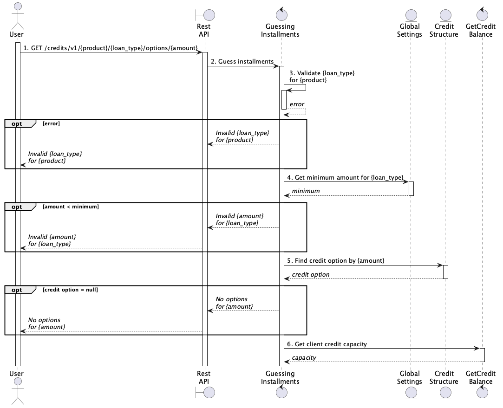

# Consultar cuotas según línea de crédito y monto solicitado

> Este documento es válido para el flujo originante por la billetera, no por la web de préstamos.

## Diagrama de secuencia


1. Un usuario, autenticado en la billetera, realiza la consulta de cuotas para una línea de crédito por un monto proporcionado.
2. El controlador delega la acción en el caso de uso Guessing Installments.
3. Se valida la combinación producto + tipo de crédito, solicitada por el usuario.
4. Se valida el monto mínimo para el tipo de crédito, solicitado por el usuario.
5. Se busca una estructura crediticia que coincida con el monto, solicitado por el usuario.
6. Se obtiene el balance crediticio del usuario.
7. Se realiza una comprobación de scoring.
8. Se verifica que la línea crediticia, asociada al balance del usuario, esté vigente.
9. Se verifica que el usuario cuente con saldo disponible para el tipo de crédito que solicitó.
10. Se crean las propuestas de crédito.

## Ejemplos

### Invalid credit product

**Request:** `GET /credits/v1/wallet/personal-loans/options/10000`

**Response**

```json
{
    "code": "invalid_credit_product",
    "message": "loan.error.invalid_credit_product",
    "errors": null,
    "sourceFile": "/var/www/waynimovil-api/app/Domain/Loans/LoanValidator.php",
    "line": "37"
}
```

### Invalid minimum amount

**Request:** `GET /credits/v1/wallet/cash-advances/options/200`

**Response**

```json
{
    "code": "loan_option_invalid",
    "message": "La opción solicitada no existe o es inválida.",
    "errors": null,
    "sourceFile": "/var/www/waynimovil-api/app/Domain/Loans/LoanOptionValidator.php",
    "line": "281"
}
```

### Invalid delivery amount

**Request:** `GET /credits/v1/wallet/cash-advances/options/3120`

**Response**

```json
{
    "code": "loan_option_invalid",
    "message": "La opción solicitada no existe o es inválida.",
    "errors": null,
    "sourceFile": "/var/www/waynimovil-api/app/Domain/Loans/LoanOptionValidator.php",
    "line": "281"
}
```

### Success

**Request:** `GET /credits/v1/wallet/cash-advances/options/3000`

**Response**
```json
{
    "result": {
        "no_membership": {
            "id": 525,
            "start_date": "2026-08-01T00:00:00-03:00",
            "principal_amount": 3000,
            "plans": [
                {
                    "id": 1399621,
                    "term_days": 31,
                    "installments_quantity": 1,
                    "payment_amount": 4569,
                    "interest_rate": 5.0903232,
                    "tfc": 6.1593,
                    "due_date": "2026-08-01T00:00:00-03:00",
                    "delivered_amount": 3000,
                    "repayable_amount": 4569,
                    "interest_amount": 1296.99,
                    "tax_amount": 272.37,
                    "insurance_amount": 0,
                    "cashout_fee": 0,
                    "cashin_fee": 0,
                    "apr": 154.8827
                }
            ]
        },
        "membership": {
            "id": 525,
            "start_date": "2026-08-01T00:00:00-03:00",
            "principal_amount": 3000,
            "plans": [
                {
                    "id": 1399621,
                    "term_days": 31,
                    "installments_quantity": 1,
                    "payment_amount": 4443,
                    "interest_rate": 4.6803232,
                    "tfc": 5.6632,
                    "due_date": "2026-08-01T00:00:00-03:00",
                    "delivered_amount": 3000,
                    "repayable_amount": 4443,
                    "interest_amount": 1192.52,
                    "tax_amount": 250.43,
                    "insurance_amount": 0,
                    "cashout_fee": 0,
                    "cashin_fee": 0,
                    "apr": 110.3274
                }
            ]
        }
    }
}
```


## Invariantes

- Para el tipo de producto billetera (`wallet`) solo se admiten los tipos de crédito (`loan_type`): adelantos (`cash-advances`) y adelantos tasa 0 (`free-interest-advances`). Cualquier otra combinación arroja un error de tipo `invalid_credit_product`.
- Todos los tipos de crédito (`loan_type`), tienen un monto mínimo establecido. En caso de que la solicitud de un cliente no supere dicho mínimo; un error de tipo `loan_option_invalid` es lanzado.
- El monto solicitado debe coincidir con el campo `delivery_amount` de alguna estructura crediticia activa. En caso de que la solicitud de un cliente coincida; un error de tipo `loan_option_invalid` es lanzado.
- El cliente debe tener un scoring crediticio > 0 y vigente. Caso contrario, retorna los siguientes mensajes de validación respectivamente: `bad_credit_score` y `nonexistent_expired_credit_line`, respectivamente.
- El monto solicitado debe ser mayor a la capacidad remanente paara `loan_type`. Caso contrario, retorna un error de tipo `credit_line_quota_exceeded`.

## Detalles de implementación

- La validación entre tipo de producto (`product`) y tipo de préstamo (`loan_type`), se lleva a cabo a traves de mappings definidos en `We\Domain\Constants\LoansContstants`.
- Los montos mínimos, que un cliente puede solicitar por tipo de préstamo (`loan_type`), están definidos en una tabla de configuración global (`environment_system`) y llevan el sufijo `-principal-minimum-amount`.
    ```sql
    SELECT * FROM environment_system es WHERE slug LIKE "%-principal-minimum-amount";
    ```
    | Config | Aplicable a |
    |--------|-------------|
    | `personal-loan-principal-minimum-amount` | `personal-loans` |
    | `advance-principal-minimum-amount` | `cash-advances` `interest-free-advances` |
    | `refinanced-loan-principal-minimum-amount` | `refinanced-loans` |
- El acceso a las variables de configuración globales es abstraido por la clase `We\Services\Credits\CreditConfigurationService`.
- Las validaciones de los pasos (4) y (5) son llevadas a cabo por la clase `We\Domain\Loans\LoanOptionValidator::performExistenceByAmountValidation`.
- Para obtener una estructura crediticia (opción de crédito) a partir del monto solicitado, se realiza la siguiente consulta.
    ```sql
    SELECT * FROM credit_structure cs WHERE cs.active  = 1 AND cs.country_id = 32 AND cs.currency_id = 3 AND cs.amount_delivery = ?;
    ```
- Los pasos (7), (8) y (9) se encuentran implementados en `We\Domain\Wallets\Advances\WalletAdvancesValidator::performCreditLineQuotaValidation`.
- El paso (10) se resuelve en la implementación `We\Services\Loans\LoanOptionService::getCurrentByClient`.

## Dudas

## Problemas (?)

- El mensaje error para la validación del caso (4) y (5) es el mismo. No permite al usuario discriminar una acción para recuperarse.

## Casos de uso relacionados

- GetCreditBalance: Obtiene la capacidad crediticia del cliente. Documentado en [este artículo](../000-credit-capacity/README.md).