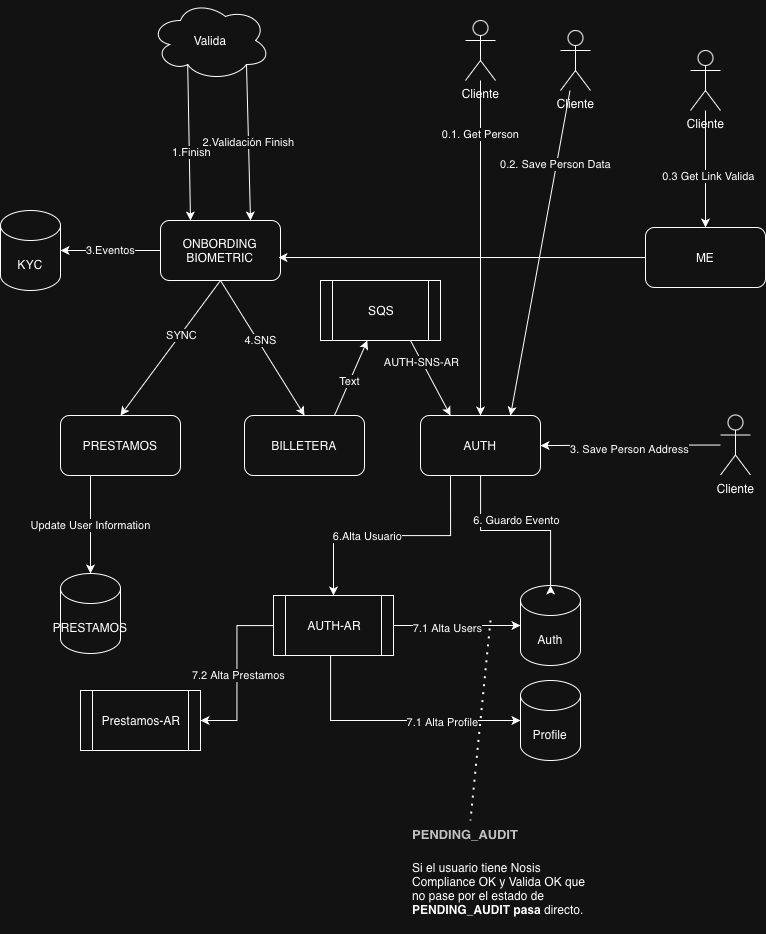
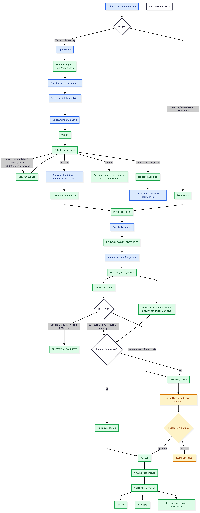

# Onboarding de billetera y alta de cuenta en Préstamos

> Este documento cubre **únicamente el registro (onboarding) originado desde la billetera** (app mobile) y la **alta de la cuenta del usuario en Préstamos** que se dispara al finalizar ese registro.

> El flujo involucra dos servicios: **`authenticator`** (Laravel/PHP, en adelante *AUTH*) que expone los endpoints de datos personales, y **`me-wallet`** (NestJS, en adelante *ME*) que actúa de BFF hacia el proveedor biométrico **Valida**.

## Servicios y responsabilidades

| Servicio | Rol | Endpoints documentados |
|---|---|---|
| `authenticator` (AUTH) | Persiste el `onboarding_user`, valida unicidad, consulta AFIP y crea el usuario final | `/api/v1/onboarding/get-legal-data`, `/save-data`, `/save-address`, `/get-data` |
| `me-wallet` (ME) | Proxy hacia el servicio de biometría (Valida) y consulta de estado consolidado | `/api/v1/me/onboarding/biometric`, `/api/v1/me/onboarding/status/{dni}` |

## Diagramas

### Arquitectura del onboarding


### Máquina de estados / decisiones internas


---

## Flujo end-to-end

El orden real de invocación desde la app mobile (`app-mobile/src/hooks/useOnboarding.ts` → `src/api/onboarding.ts`) es:

1. **`POST /api/v1/onboarding/get-legal-data`** (AUTH) — Valida que la persona no exista aún y trae sus datos legales desde AFIP (padrón).
2. **`POST /api/v1/onboarding/save-data`** (AUTH) — Persiste el `onboarding_user` (datos personales + password). Devuelve el `uuid`.
3. **`POST /api/v1/me/onboarding/biometric`** (ME → Valida) — Crea el *enrollment* biométrico y devuelve la URL a la que redirige la app para la selfie + validación de DNI.
4. **`POST /api/v1/onboarding/save-address`** (AUTH) — Persiste el domicilio y los términos aceptados. **Este endpoint dispara el job asincrónico** (`ProcessOnboardingUserJob` vía SQS) que hace la creación efectiva del usuario y la propagación a Préstamos/Billetera.
5. **`POST /api/v1/onboarding/get-data`** (AUTH) — Consulta el `onboarding_user` para saber si los campos requeridos ya fueron completados (`onboarding_fields_completed`).
6. **`GET  /api/v1/me/onboarding/status/{dni}`** (ME) — Consulta de estado consolidado (billetera + Valida) usada para hacer *polling* mientras se completa la validación.

> Los 4 endpoints de AUTH van bajo el middleware **`validate.encryption`** (`App\Http\Middleware\ValidateEncryption`): el body viaja cifrado extremo a extremo.

---

## Endpoints de AUTH (`authenticator`)

Controlador: `App\Http\Controllers\Api\Onboarding\V1\OnboardingController`.
Servicio: `App\Services\Onboarding\OnboardingService`.
Rutas: `routes/api.php` (grupo `prefix => onboarding`).

### 1. `POST /api/v1/onboarding/get-legal-data`

Valida unicidad de la persona y devuelve los datos del padrón de AFIP para el DNI.

**Acción:** `OnboardingController::getPersonData` → `OnboardingService::getPersonData`.

**Request** (`GetPersonDataRequest`)

```json
{
  "identity_number": "30123456",
  "email": "juan.perez@example.com",
  "phone_number": "1122334455"
}
```

| Campo | Regla |
|---|---|
| `identity_number` | `required\|string` |
| `email` | `required\|email` |
| `phone_number` | `required\|string` |

**Lógica**

1. `checkLoanOrWalletUserExists()` — verifica que el DNI / email / teléfono **no exista** ni en billetera ni en Préstamos.
   - Si existe en billetera → `UserAlreadyExistsException` (422).
   - Si existe en Préstamos y **no** aplica *linking* → `UserLoanAlreadyExistsException` (422). Ver [Vinculación con Préstamos](#vinculación-con-préstamos-linking).
2. `AfipPadronService::findAliveByDocumentNumber($dni)` — consulta el padrón AFIP y descarta fallecidos (`died === 1`).
3. Si AFIP no devuelve nada → `PersonNotFoundInAfipException` (422).

**Response** — `GetPersonDataCollection` (colección; una persona puede tener varias entradas de padrón)

```json
[
  {
    "identity_number": "30123456",
    "full_name": "PEREZ JUAN",
    "gender": "M",
    "tax_identification_value": "20301234567"
  }
]
```

| Dato | Origen |
|---|---|
| `identity_number` | `AfipPadronDataDto::document_number` |
| `full_name` | `AfipPadronDataDto::full_name` |
| `gender` | `AfipPadronDataDto::gender` |
| `tax_identification_value` | `AfipPadronDataDto::legal_number` (CUIT/CUIL) |

---

### 2. `POST /api/v1/onboarding/save-data`

Persiste (o actualiza) el registro `onboarding_user` con los datos personales y la contraseña.

**Acción:** `OnboardingController::savePersonData` → `OnboardingService::savePersonData` → `OnboardingUserRepository::saveOnboardingUser`.

**Request** (`SavePersonDataRequest`)

```json
{
  "identity_number": "30123456",
  "phone_number": "1122334455",
  "full_name": "PEREZ JUAN",
  "password": "Secreta123",
  "password_confirmation": "Secreta123",
  "tax_identification_value": "20301234567",
  "gender": "M",
  "email": "juan.perez@example.com"
}
```

| Campo | Regla |
|---|---|
| `identity_number` | `required\|string` |
| `phone_number` | `required\|string` |
| `full_name` | `required\|string` |
| `password` | `required\|confirmed\|max:32`, `Password::min(8)->mixedCase()->numbers()` |
| `tax_identification_value` | `required` |
| `gender` | `required` |
| `email` | `required\|email` |

**Lógica**

1. Vuelve a ejecutar `checkLoanOrWalletUserExists()` (misma semántica que get-legal-data).
2. `saveOnboardingUser()` hace un **`updateOrCreate` por `identity_number`**: si el DNI ya inició un onboarding, se pisan los datos. La `password` se guarda con `bcrypt`.

**Response** `201 Created` — `SavePersonDataResource` (serializa el modelo `OnboardingUser`, sin `password`). Incluye el `uuid` generado que será usado en `save-address` y en la biometría.

```json
{
  "data": {
    "uuid": "9f1c2b7a-....",
    "identity_number": "30123456",
    "email": "juan.perez@example.com",
    "gender": "M",
    "full_name": "PEREZ JUAN",
    "phone_number": "1122334455"
  }
}
```

---

### 3. `POST /api/v1/onboarding/save-address`

Persiste el domicilio + identificador de términos y **dispara la creación efectiva del usuario**.

**Acción:** `OnboardingController::savePersonAddress` → `OnboardingService::savePersonAddress`.

**Request** (`SavePersonAddressRequest`)

```json
{
  "uuid": "9f1c2b7a-....",
  "street_name": "Av. Siempre Viva",
  "street_number": "742",
  "floor": "3",
  "apartment": "B",
  "zip_code": "1000",
  "neighborhood": "Centro",
  "city": "CABA",
  "city_id": 1,
  "region": "Buenos Aires",
  "region_id": 2,
  "terms_and_conditions_identifier": "terms-v3"
}
```

| Campo | Regla (destacadas) |
|---|---|
| `uuid` | `required\|uuid` (el devuelto por `save-data`) |
| `street_name` / `street_number` | `required` + regex alfanumérico |
| `floor` / `apartment` / `neighborhood` | `nullable` + regex |
| `zip_code` | `required\|regex:/^[0-9]{1,4}$/` |
| `city_id` / `region_id` | `required\|integer\|min:1\|not_in:9999` |
| `city` / `region` | `required` + regex |
| `terms_and_conditions_identifier` | `required\|string\|max:255` |

**Lógica**

1. Busca el `onboarding_user` por `uuid` (`findOnboardingUserByUuid`). Si no existe → `404`.
2. `saveOnboardingUserAddress()` — `update` del modelo con los campos de domicilio.
3. **`dispatchProcessOnboardingUser($uuid)`** — encola `ProcessOnboardingUserJob` en la conexión **`sqs`**. Aquí arranca la alta asincrónica (ver [Alta de cuenta](#alta-de-cuenta-processonboardinguserjob)).

**Response** `201 Created`

```json
{ "message": "Person address saved successfully" }
```

---

### 4. `POST /api/v1/onboarding/get-data`

Devuelve el estado del `onboarding_user`, principalmente si ya completó los campos requeridos.

**Acción:** `OnboardingController::getOnboardingUser` → `OnboardingService::getOnboardingUser`.
Recibe directamente un `GetOnboardingUserRequestDto` (spatie/laravel-data), **sin FormRequest**.

**Request** — el front envía el email en ambos campos (ver `getONBUser` en `onboarding.ts`):

```json
{
  "identity_number": "juan.perez@example.com",
  "email": "juan.perez@example.com"
}
```

La búsqueda es `WHERE identity_number = ? OR email = ?` (`getOnboardingUser` en el repositorio). Si no hay coincidencia → `404`.

**Response** `200 OK`

```json
{
  "data": {
    "uuid": "9f1c2b7a-....",
    "identity_number": "30123456",
    "gender": "M",
    "onboarding_fields_completed": true
  }
}
```

| Dato | Descripción |
|---|---|
| `onboarding_fields_completed` | `true` cuando `street_name`, `street_number` y `terms_and_conditions_identifier` están cargados. Calculado en `OnboardingUserDto::setOnboardingCompleted()` |

---

## Endpoints de ME (`me-wallet`) — biometría y estado

Controlador: `me-wallet/src/me/me.controller.ts`.
Servicio: `MeService` → `OnboardingBiometricService` (proxy HTTP hacia **Valida**).

### 5. `POST /api/v1/me/onboarding/biometric`

Crea el *enrollment* biométrico en Valida y devuelve la URL de validación (selfie + DNI).

**Acción:** `MeController::createEnrollment` → `MeService.createEnrollment` → `OnboardingBiometricService.createEnrollment` → `POST {valida}/api/Onboarding/create`.

**Request** (`CreateEnrollmentRequestDto`)

```json
{
  "userUuid": "9f1c2b7a-....",
  "documentNumber": "30123456",
  "gender": "M"
}
```

El servicio completa automáticamente: `channel = AppMobile`, `urlRedirect = 1`, `origin = Billetera`, `tags = ONBOARDING_MOBILE`.

**Response** (`CreateEnrollmentResponseDto`)

```json
{
  "url": "https://valida.../enrollment/abc",
  "externalRefId": "…",
  "externalIdentifier": "…",
  "status": "PENDING"
}
```

> Existen dos endpoints hermanos no solicitados pero parte del mismo flujo:
> - `POST /api/v1/me/onboarding/biometric/reprocess` — reintenta un enrollment fallido.
> - `GET /api/v1/me/onboarding/biometric/getInformation/{dni}` — trae el detalle del enrollment (nombre, apellido, fecha de nacimiento, `status`, imágenes, facematching).

### 6. `GET /api/v1/me/onboarding/status/{dni}`

Estado **consolidado** para el *polling* de la app: combina el estado de la billetera (AUTH) con el de Valida.

**Acción:** `MeController::getInformationStatusByDni` → `MeService.getInformationStatusByDni`.

**Lógica**

1. `authService.getUserProfile(dni, 'wallet')` — consulta AUTH (`/api/v1/public/user/{dni}/wallet`).
2. `onboardingBiometricService.getInformation(dni)` — consulta Valida.

**Response** (`GetInformationStatusByDniResponse`)

```json
{
  "walletIsValid": true,
  "validaIsValid": true
}
```

| Dato | Regla |
|---|---|
| `walletIsValid` | `auth.status == ACTIVE && auth.pomeloUsr != null` |
| `validaIsValid` | `valida.status == SUCCESS` |

---

## Alta de cuenta (`ProcessOnboardingUserJob`)

Disparado por `save-address` a través de SQS. Es donde ocurre la creación real del usuario y la propagación a Billetera y Préstamos.

**Clase:** `App\Jobs\ProcessOnboardingUserJob` (`tries = 3`, `ShouldBeUnique` con `uniqueFor = 3600` y `uniqueId = process-onboarding-user:{uuid}` para evitar dispatches duplicados concurrentes).

**Secuencia (`handle`)**

1. Carga el `onboarding_user` por uuid. Si `user_created_success == true` → **idempotente**, retorna sin hacer nada.
2. Si el usuario **no** está validado con status `SUCCESS`, o le faltan `name` / `surname` / `birthdate`, o `gender` es `UNKNOWN`:
   - Llama a `OnboardingBiometricService::getBiometricValidationInformation()` (AUTH → Valida, `GET /getInformation/{dni}`).
   - Actualiza el `onboarding_user` con lo devuelto (nombre, apellido, fecha, `validation_status`).
   - Si la validación **no** fue `SUCCESS` o faltan datos clave → `return false` (no reintenta, queda a la espera de un reproceso).
3. Si está todo OK, construye `ProcessOnboardingUserRequestDto` y llama a `OnboardingService::processOnboardingUser()`.

**`OnboardingService::processOnboardingUser` → `saveAuthUser`**

- Resuelve la decisión de *linking* **una sola vez** (`resolveLinkUuid`): si aplica, el `effectiveUuid` es el UUID de Préstamos; si no, es el uuid del onboarding.
- **Idempotencia:** `resolveIdempotentWalletUser()` — si ya existe un `User` con ese `effectiveUuid` y misma identidad (DNI + email + teléfono), devuelve ese usuario con `created = false` (replay seguro ante dispatches duplicados).
- **Concurrencia (CONC-02):** toda la verificación + creación corre dentro de un **lock de Redis por DNI** (`onboarding:dni:{dni}`, `block(5)`), cerrando la ventana TOCTOU entre el chequeo de existencia y el `INSERT`.
  - Duplicado dentro del lock con identidad coincidente → replay idempotente.
  - Duplicado con identidad distinta → `UserLoanAlreadyExistsException`.
  - `QueryException` con `ER_DUP_ENTRY (1062 / SQLSTATE 23000)` → se reintenta el replay idempotente; si no, se traduce a "ya existe" (nunca 500).
  - `LockTimeoutException` → se trata como "en progreso / ya existe" (`UserLoanAlreadyExistsException`).
- El `INSERT` corre dentro de `DB::transaction`. Los `event(...)` se disparan **fuera** del lock y la transacción (evita publicar a SNS ante un rollback).

**Eventos emitidos cuando se crea el usuario (`wasCreated == true`)**

| Evento | Efecto |
|---|---|
| `UserCreated` | Alta en Billetera (SNS `AUTH-SNS-AR`), crea Users / Profile |
| `UserCreatedFromOnboarding` | Propaga a **Préstamos** (alta AUTH-AR, `isLinkedFromLoan`) |
| `UserTermsAccepted` | Registra aceptación de términos |
| `SwornStatementsAccepted` | Registra declaración jurada (PEP/SO en `false`) |

El usuario final se crea con `origin = WALLET_APP_ONBOARDING` e `identity_validation_supplier = VALIDA`.

### Vinculación con Préstamos (linking)

Cuando la persona **ya existe en Préstamos** pero no en Billetera, y el feature flag está activo (`LinkLoanUsersFeatureFlag`), se **reutiliza el UUID de Préstamos** (`effectiveUuid`) en lugar de crear uno nuevo, evitando duplicar la identidad entre productos.

- Flag apagado o resolver ambiguo/nulo → **fail-safe**: no se vincula y, si la persona existe en Préstamos, se rechaza el alta (`UserLoanAlreadyExistsException`).
- En el path de linking se **omite** el guard de UUID de Préstamos (`findByUuid`), porque ese UUID es justamente el que se está vinculando.

---

## Diccionario de datos — tabla `onboarding_users`

| Columna | Origen / paso |
|---|---|
| `uuid` | Autogenerado al crear el registro (`save-data`) |
| `identity_number` | `save-data` (clave de `updateOrCreate`) |
| `tax_identification_value` | `save-data` (CUIT/CUIL de AFIP) |
| `gender`, `full_name`, `phone_number`, `email` | `save-data` |
| `password` | `save-data`, con `bcrypt` |
| `name`, `surname`, `birthdate` | Completados por la **validación biométrica** (Valida) durante el job |
| `street_name`, `street_number`, `floor`, `apartment`, `zip_code`, `neighborhood`, `city`, `city_id`, `region`, `region_id` | `save-address` |
| `terms_and_conditions_identifier` | `save-address` |
| `is_validated`, `validated_at`, `validation_status` | Actualizados por el job tras consultar Valida |
| `user_created_success` | `true` cuando la alta en Billetera se completó (idempotencia del job) |

Restricción única: `(identity_number, tax_identification_value, phone_number, gender, email)`.

---

## Estados de validación (Valida) — ver `onboarding-internal.png`

- `SUCCESS` → alta directa (si además Nosis Compliance OK, saltea `PENDING_AUDIT`).
- `PENDING_AUDIT` → requiere auditoría / backoffice manual; puede resolver a `ACTIVE` o `REJECTED_AUTO_AUDIT`.
- `new / incomplete / formal_end / validation_in_progress` → queda en espera de que el usuario complete la biometría.
- `failed / system_error` → no continúa el alta; se muestra pantalla de reintento (reprocess).

---

## Invariantes

- Un DNI/email/teléfono **no puede** existir simultáneamente en Billetera y Préstamos salvo por el mecanismo explícito de *linking*.
- La creación del `User` es **idempotente** por `effectiveUuid` + identidad; múltiples dispatches del job no crean duplicados.
- Los eventos hacia SNS/Billetera/Préstamos **solo** se emiten si el `INSERT` no fue revertido.

## Dudas / Observaciones

- `get-data` usa `identity_number OR email`, y el front envía el email en ambos campos; conviene confirmar que no genere colisiones cuando un email coincide con otro registro.
- `save-data` hace `updateOrCreate` por `identity_number`: reiniciar el onboarding sobrescribe los datos previos (incluida la password).
- El `OnboardingController::processOnboardingUser` existe pero **no está ruteado**; la alta ocurre exclusivamente vía el job SQS.
