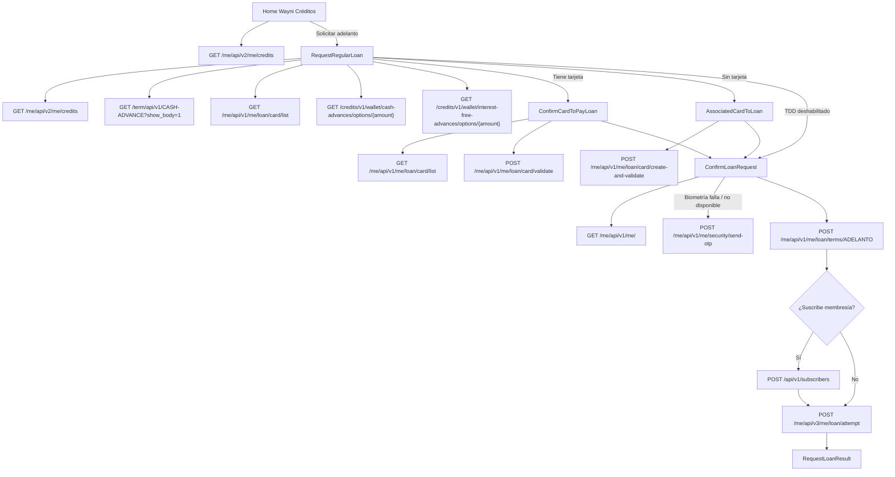

# Flujo Wayni Créditos — Endpoints por fase

Documentación de los endpoints HTTP consumidos en el flujo de `src/screens/waynicredits`.

---

## Fase 1 — Home Wayni Créditos (`HomeWayniCredits`)

Pantalla principal del tab de créditos.

| Qué hace | Endpoint |
| --- | --- |
| Trae líneas de crédito (adelantos, tasa 0, préstamos) | `GET /me/api/v2/me/credits` |

**Sin API directa:** `useMeStore` lee el `me` cacheado (de `/me/api/v1/me/`, cargado en otro momento de la app).

---

## Fase 2 — Solicitar adelanto (`RequestRegularLoan`)

El usuario elige monto y plan.

| Qué hace | Endpoint |
| --- | --- |
| Refresca líneas de crédito | `GET /me/api/v2/me/credits` |
| Trae términos y condiciones (guarda `identifier` para confirmar) | `GET /term/api/v1/CASH-ADVANCE?show_body=1` |
| Consulta si ya tiene tarjeta guardada | `GET /me/api/v1/me/loan/card/list` |
| Trae planes de adelanto con tasa | `GET /credits/v1/wallet/cash-advances/options/{amount}` |
| Trae planes tasa 0 (según membresía/monto) | `GET /credits/v1/wallet/interest-free-advances/options/{amount}` |

Al tocar **Continuar** → va a validación de TDD o directo a confirmación (si TDD está deshabilitado por feature flag).

---

## Fase 3 — Tarjeta de débito TDD

### 3a — Ya tiene tarjeta (`ConfirmCardToPayLoan`)

| Qué hace | Endpoint |
| --- | --- |
| Lista tarjetas guardadas | `GET /me/api/v1/me/loan/card/list` |
| Valida la TDD seleccionada (cobro de verificación) | `POST /me/api/v1/me/loan/card/validate` |

### 3b — No tiene tarjeta (`AssociatedCardToLoan` → `AssociatedCardScreen`)

| Qué hace | Endpoint |
| --- | --- |
| Alta y validación de nueva TDD | `POST /me/api/v1/me/loan/card/create-and-validate` |

---

## Fase 4 — Confirmar adelanto (`ConfirmLoanRequest`)

| Qué hace | Endpoint |
| --- | --- |
| Refresca datos del usuario (cuenta wallet) | `GET /me/api/v1/me/` |
| Envía OTP por SMS (si no usa biometría) | `POST /me/api/v1/me/security/send-otp` |
| Acepta términos del adelanto | `POST /me/api/v1/me/loan/terms/ADELANTO` |
| Suscribe a Wayni+ (solo si aplica en el flujo) | `POST /api/v1/subscribers` |
| Intenta otorgar el adelanto | `POST /me/api/v3/me/loan/attempt` |

**Orden al confirmar:**

1. Biometría local **o** OTP
2. `acceptLoansTerms` → `finishAdvance` (con OTP o firma biométrica)
3. Si hay suscripción a membresía → `createSubscriber` antes del attempt

---

## Lista completa de endpoints

```
GET  /me/api/v1/me/
GET  /me/api/v2/me/credits
GET  /me/api/v1/me/loan/card/list
POST /me/api/v1/me/loan/card/create-and-validate
POST /me/api/v1/me/loan/card/validate
POST /me/api/v1/me/loan/terms/ADELANTO
POST /me/api/v3/me/loan/attempt
POST /me/api/v1/me/security/send-otp
GET  /credits/v1/wallet/cash-advances/options/{amount}
GET  /credits/v1/wallet/interest-free-advances/options/{amount}
GET  /term/api/v1/CASH-ADVANCE?show_body=1
POST /api/v1/subscribers
```

---

## Diagrama



---

## Happy path

```
Home → RequestRegularLoan → ConfirmCardToPayLoan → ConfirmLoanRequest → RequestLoanResult
         (líneas + planes)     (valida TDD)           (OTP → términos → attempt)
```
