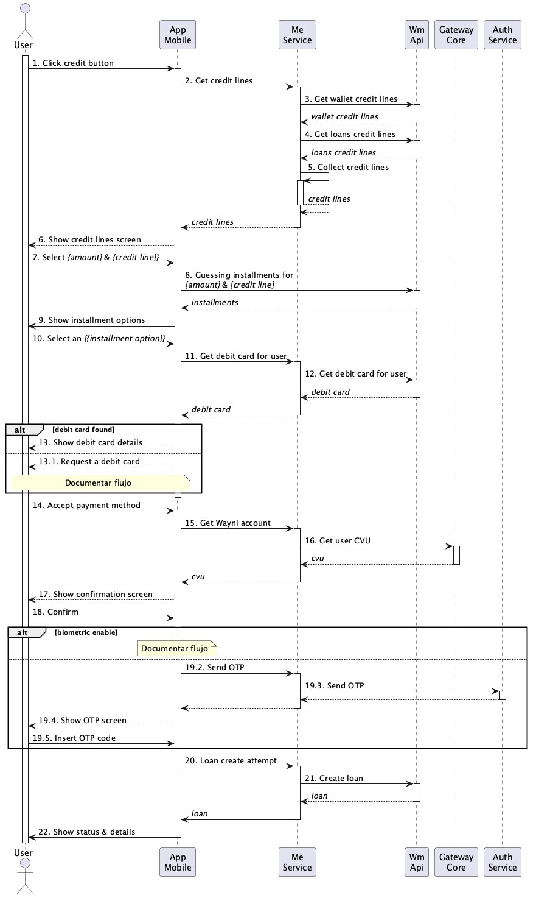

# Credit request

## Diagrama de secuencia

1. Un usuario, autenticado en la aplicación, selecciona cargar la sección de créditos.
2. La aplicación realiza una llamada `GET /v2/me/credits` del servicio `Me`.
3. El servicio `Me` consulta las líneas de crédito disponibles, para billetera, al servicio `Wm Api`, mediante la llamada `GET /credits/v1/wallet/lines/summaries`.
4. El servicio `Me` consulta las líneas de crédito disponibles, para préstamos, al servicio `Wm Api`, mediante la llamada `GET /credits/v1/loans/lines/summaries`.
5. El servicio `Me` hace un merge de las líneas de crédito obtenidas en (3) y (4) y las retorna.
6. La aplicación renderiza la pantalla de líneas de crédito disponibles.
7. El usuario selecciona una línea de crédito y un monto.
8. La aplicación realiza una llamada `GET /credits/v1/{{product}}/{{credit_type}}/options/{{requested_amount}}`, al servicio `Wm Api`, para obtener las opciones de cuotas disponibles.
9. La aplicación renderiza el listado de cuotas disponibles.
10. El usuario selecciona una opción de cuotas
